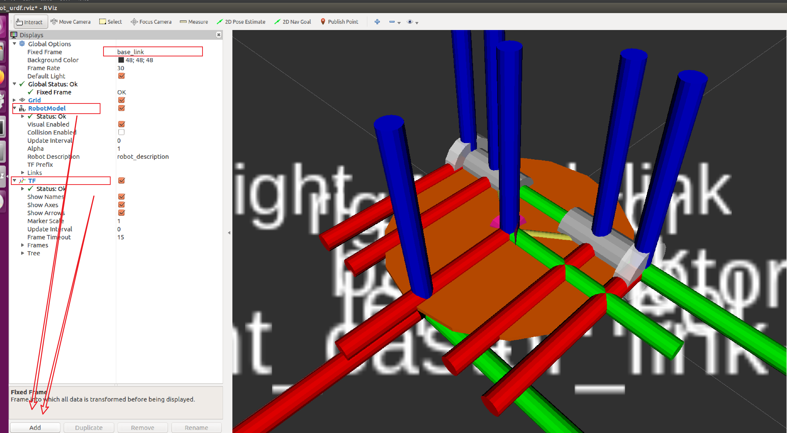

# gazbo

### 创建环境
```shell
➜  ros git:(master) ✗ mkdir -p mrobot_desc_ws/src
➜  ros git:(master) ✗ cd mrobot_desc_ws/src 
➜  src git:(master) ✗ git checkout mrobot_desc_ws
➜  src git:(mrobot_desc_ws) ✗ catkin_create_pkg mrobot_description urdf xacro
➜  src git:(mrobot_desc_ws) ✗ cd ..
➜  mrobot_desc_ws git:(mrobot_desc_ws) ✗ catkin_make
# 设置编码
➜  mrobot_desc_ws git:(mrobot_desc_ws) ✗ sudo apt install unicode
➜  mrobot_desc_ws git:(mrobot_desc_ws) ✗ sudo find / -name sitecustomize.py    
/usr/lib/python2.7/sitecustomize.py
/usr/lib/python3.5/sitecustomize.py
/etc/python2.7/sitecustomize.py
/etc/python3.5/sitecustomize.py
# 把找到的文件中，都加入内容：
import sys
reload(sys)
sys.setdefaultencoding('utf-8')

# 检测udrf配置是否正确
➜  mrobot_description git:(mrobot_desc_ws) ✗ sudo apt install liburdfdom-tools ros-kinetic-joint-state-publisher-gui
➜  mrobot_description git:(mrobot_desc_ws) ✗ cd urdf 
➜  urdf git:(mrobot_desc_ws) ✗ check_urdf mrobot_chassis.urdf 
Error:   Error reading Attributes.
         at line 72 in /build/urdfdom-UJ3kd6/urdfdom-0.4.1/urdf_parser/src/model.cpp
ERROR: Model Parsing the xml failed
➜  urdf git:(mrobot_desc_ws) ✗ 
# 检查不通过，使用在线xml格式化工具检测一遍
➜  urdf git:(mrobot_desc_ws) ✗ urdf_to_graphiz mrobot_chassis.urdf
# rviz
➜  urdf git:(mrobot_desc_ws) ✗ sudo find / -name sizecustomize.py
➜  urdf git:(mrobot_desc_ws) ✗ roslaunch mrobot_description display_mrobot_chassis_urdf.launch
```


- udrf: 配置机器人外观
- urdf_to_graphiz: 查看节点连接信息
